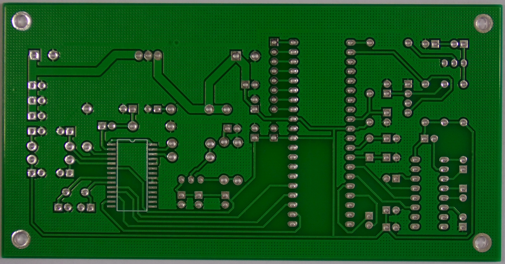
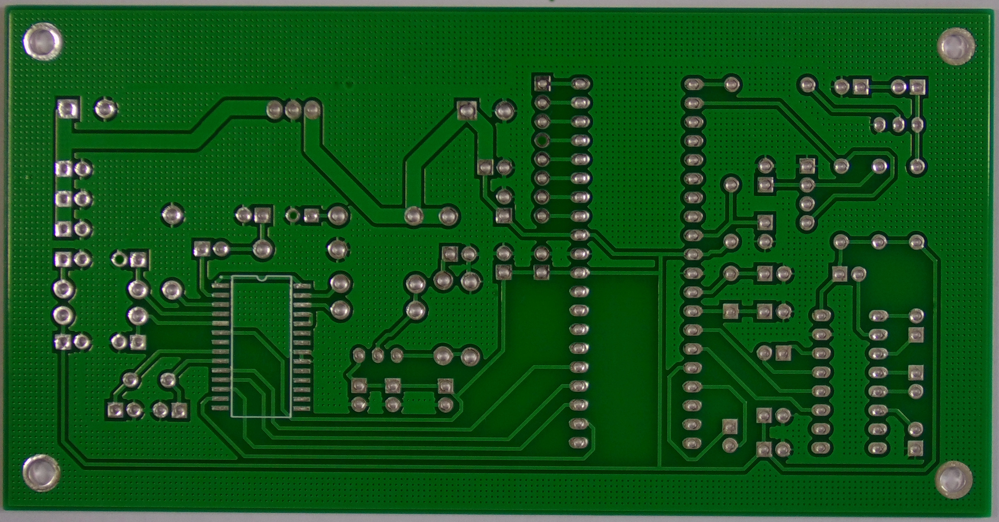
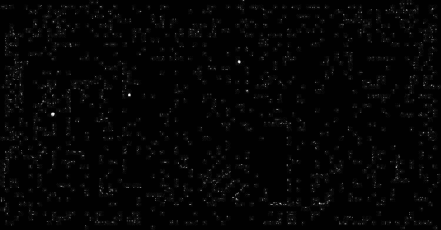

# PCB Defect Detection

  
  
  

### Output: "Detected: 3 defects"

> Implementation of a classical image processing method for defect detection on PCB (*Printed Circuit Board*) based on the article:

> P. Kumar, M. Panchal, R. Sahu,  
> *Comparative Study of Image Processing and Transfer Learning Techniques for an Automated PCB Fault Detection System*,  
> IJRASET, Volume 9 Issue VI, June 2021.

## How It Works

The algorithm compares two images: a **reference image** (defect-free) and a **test image** (potentially faulty), in order to identify visual differences that indicate defects.

### Processing Steps:

1. **Image loading and resizing** – convert to grayscale and scale down to match the GUI display size.
2. **Gaussian blur** – smooth the image and reduce noise.
3. **Adaptive thresholding** – binarize the image, robust against uneven lighting.
4. **Image subtraction** – detect differences between the reference and test images.
5. **Median filtering** – remove noise after subtraction.
6. **Segmentation and defect counting** – find contours and filter objects by area.

## Results

In tests, the algorithm successfully detected typical PCB issues such as:
- missing holes,
- excess tracks,
- short circuits,
- broken connections.

Results were presented both visually and numerically. A simple GUI displayed each processing step.

## Requirements

- Python 3.x  
- OpenCV (`cv2`)  
- Tkinter (for GUI)

## Files

- `main.py` – main source file  
- `template_rgb.JPG` – reference image  
- `test_rgb.jpg` – test image  
- `subtracted_image.png`, `final_result.png` – example outputs

## Conclusion

Although basic, classical image processing techniques can be effective for PCB defect detection without the need for AI models. This method works well with high-quality input images and in controlled environments.

## License

Educational project – not intended for production use.
