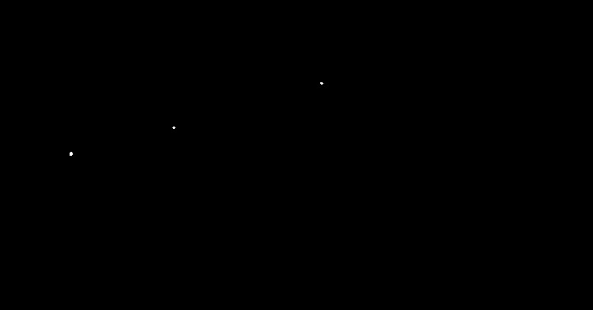

# Wykrywanie defektów na płytkach PCB

> Zaimplementowanie klasycznej metody detekcji defektów na płytkach PCB (ang. *Printed Circuit Board*) na podstawie artykułu:

> P. Kumar, M. Panchal, R. Sahu,  
> *Comparative Study of Image Processing and Transfer Learning Techniques for an Automated PCB Fault Detection System*,  
> IJRASET, Volume 9 Issue VI, June 2021.

## Opis działania

Algorytm porównuje dwa obrazy: referencyjny (bez defektów) i testowy (potencjalnie uszkodzony), aby wykryć różnice wskazujące na defekty.

### Etapy przetwarzania:

1. **Wczytanie i skalowanie obrazów** – konwersja do skali szarości, zmniejszenie do rozmiaru GUI.
2. **Rozmycie Gaussowskie** – redukcja szumów i wygładzenie obrazu.
3. **Progowanie adaptacyjne** – binarizacja odporna na nierównomierne oświetlenie.
4. **Odejmowanie obrazów** – wykrycie różnic między obrazem testowym i referencyjnym.
5. **Filtracja medianowa** – usunięcie pojedynczych szumów po odejmowaniu.
6. **Segmentacja i zliczanie defektów** – wykrycie konturów i odfiltrowanie obiektów poza zakresem rozmiaru.

## Wyniki

W testach algorytm skutecznie wykrywał typowe błędy jak:
- brak otworów,
- nadmiar ścieżek,
- zwarcia,
- nieciągłości przewodników.

Wyniki były wizualizowane i liczbowe, a GUI prezentowało poszczególne kroki analizy obrazu.

## Wymagania

- Python 3.x  
- OpenCV (`cv2`)  
- Tkinter (dla GUI)

## Pliki

- `main.py` – główny plik źródłowy  
- `template_rgb.JPG` – obraz referencyjny  
- `test_rgb.jpg` – obraz testowy  
- `subtracted_image.png`, `final_result.png` – przykładowe wyniki

## Wnioski

Klasyczne przetwarzanie obrazu, choć proste, może być skuteczne w detekcji defektów PCB bez konieczności używania modeli AI. Metoda dobrze sprawdza się przy dobrej jakości wejściowych obrazów i w warunkach kontrolowanych.

## Licencja

Projekt edukacyjny – brak licencji produkcyjnej.
